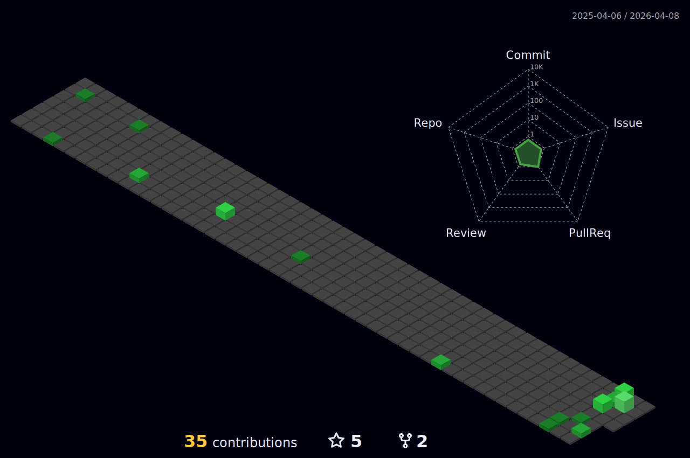

# Hi, I'm [Matteo](https://about.me/matteomaragliano/getstarted) 

- 😄 Pronouns: He/Him
- 🇮🇹 Italy, 📍 Genoa
- 🇫🇷 France, 📍 Nantes: Erasmus + traineeship 
- 👨🏻‍🎓 [Electronic Engineering and Information Technology](https://corsi.unige.it/corsi/9273) Bachelor degree
- 📚 [Robotics Engineering](https://courses.unige.it/10635) Master degree
- 🔭 I’m currently working on .. something cool
- 🌱 I’m currently learning ROS and ROS2, Machine Learning an some other interensting stuff
- ⚡️ Fun facts: coffee ☕️ lover and Formula 1 🏎 fan
---

---

🔗 &nbsp;**Connect with me**

  

<a href="https://t.me/Smizz99" target="blank">

  

---

  
<b>🛠️&nbsp;&nbsp;Languages&nbsp;and&nbsp;Tools</b>

   
  
 
   
   
  
  
  
  
  
  
  
  
  
  
  
  
  
  
  
  
  
  

---

<b>🔥&nbsp;&nbsp;My Stats</b>
  

 

---

<b>👓&nbsp;&nbsp;3D Profile</b>
  

  

---

<b>📈&nbsp;&nbsp;Contribution graph</b>
  

  
 

---

<b>🐍&nbsp;&nbsp;Snake</b>
  

